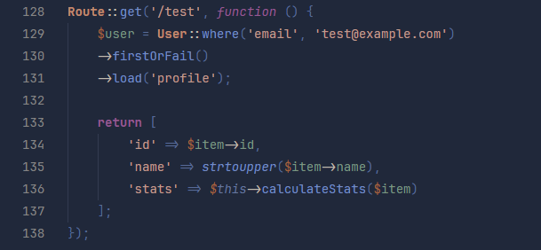
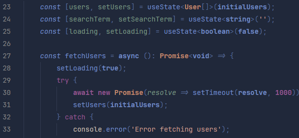
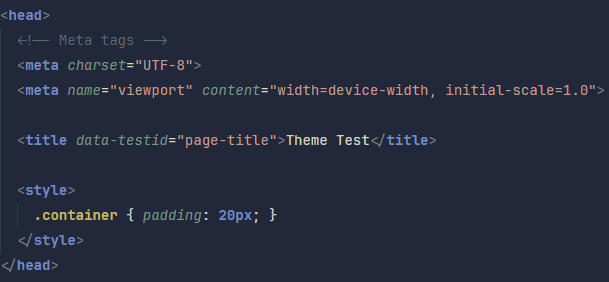

# 🎨 Astigmatism Theme

**An elegant and productive color palette for VS Code**  
*Developed especially for PHP and Laravel with a focus on better visualization for those with astigmatism*


## ✨ Features

### Examples







## 🎨 Personalization

Add these settings to your `settings.json` for better experience:

```json
{
  "workbench.colorTheme": "Astigmatism Theme",
  "editor.fontFamily": "JetBrains Mono",
  "editor.fontLigatures": true,
  "editor.tokenColorCustomizations": {
    "[Astigmatism Theme]": {
      "comments": "#5F6675"
    }
  }
}
```

## 🌈 Complete Palette

| Color | Main Use | Hexadecimal |
|-------------------|---------------------|-------------|
|  `#1A202E` | Main Fund | `#1A202E` |
|  `#758DC4` | Functions/Keywords | `#758DC4` |
|  `#975A92` | Classes/Types | `#975A92` |
|  `#7C9782` | Strings | `#7C9782` |
|  `#AC6F3A` | Variables | `#AC6F3A` |

## 🤝 Contribution
Contributions are welcome! Follow these steps:
1. Fork the repository
2. Create a branch: `git checkout -b feat/new-feature`
3. Commit your changes: `git commit -m 'Add something'`
4. Push: `git push origin feat/new-feature`
5. Open a Pull Request